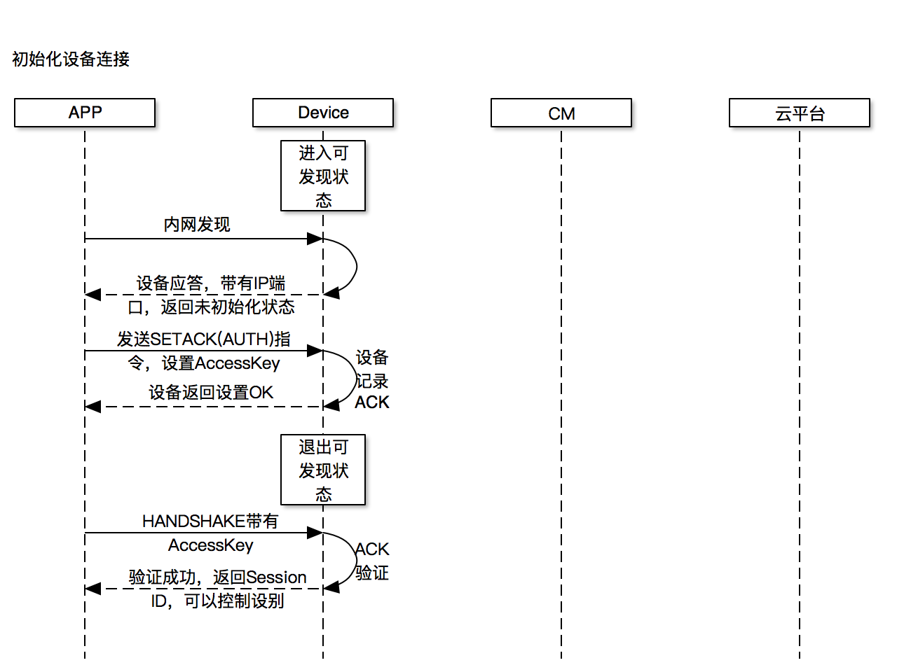
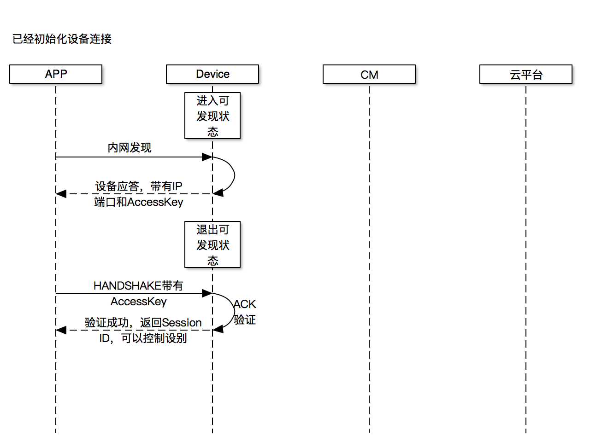
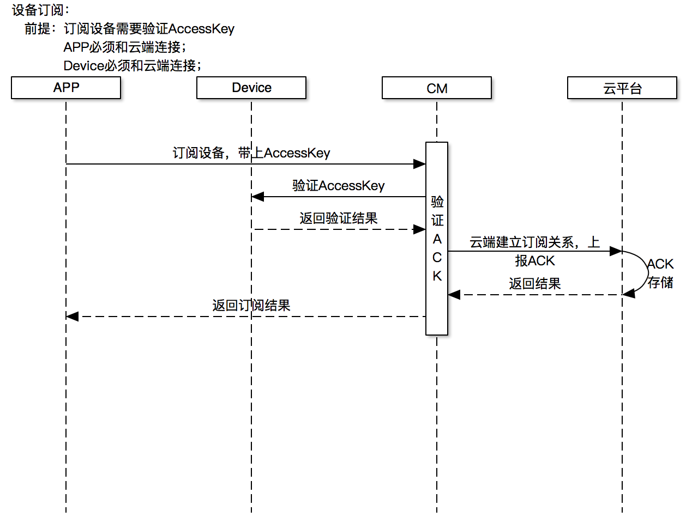
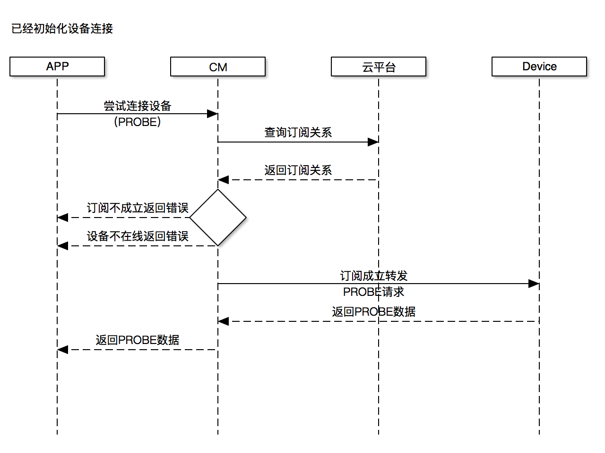

©2016  **云智易** 物联云平台（http://www.xlink.cn）

# Windows APP SDK集成文档

## 说明

- 该文档适用于使用云智易Windows APP SDK的开发人员。
- 厂商可以使用Windows APP SDK模拟APP所对应的功能，包括设备扫描、发现，内网鉴权控制，云端认证登录，设备订阅控制等。适合作为产品出厂时的自动化产测工具。
- 使用云智易Windows APP SDK可以将Windows系统作为APP接入到云智易物联网平台，以使用平台提供的相关功能。

## **技术约束**

- Windows APP SDK使用Windows API编写，通过Windows动态连接库导出函数方式暴露接口。
- Windows APP SDK支持多种语言调用，如VC，C#，VB，Delphi等。
- 使用Windows APP SDK的云端功能（包括但不限于认证、登录、订阅设备以及控制设备）必须保证Windows处于能够连接互联网状态。

## **名称解释**

- **AppID**
  * APP登录到云端所使用的数字ID。用户在云智易平台通过[手机](https://github.com/xlink-corp/xlink-sdk/blob/master/%E5%BA%94%E7%94%A8%E7%AB%AF%E5%BC%80%E5%8F%91%E6%96%87%E6%A1%A3/%E5%BA%94%E7%94%A8%E7%AB%AFRESTful%E6%8E%A5%E5%8F%A3%E6%96%87%E6%A1%A3/%E7%94%A8%E6%88%B7%E8%BA%AB%E4%BB%BD%E6%8E%A5%E5%8F%A3.md#4通过手机验证码注册新账号)或者[邮箱注册](https://github.com/xlink-corp/xlink-sdk/blob/master/%E5%BA%94%E7%94%A8%E7%AB%AF%E5%BC%80%E5%8F%91%E6%96%87%E6%A1%A3/%E5%BA%94%E7%94%A8%E7%AB%AFRESTful%E6%8E%A5%E5%8F%A3%E6%96%87%E6%A1%A3/%E7%94%A8%E6%88%B7%E8%BA%AB%E4%BB%BD%E6%8E%A5%E5%8F%A3.md#1使用邮箱注册新账号)后，会得到这个数字ID。
- **AppKey**
  * APP通过AppID登录到云端所使用的凭证，也称为**authorize_code**；通过平台的[用户认证接口](https://github.com/xlink-corp/xlink-sdk/blob/master/%E5%BA%94%E7%94%A8%E7%AB%AF%E5%BC%80%E5%8F%91%E6%96%87%E6%A1%A3/%E5%BA%94%E7%94%A8%E7%AB%AFRESTful%E6%8E%A5%E5%8F%A3%E6%96%87%E6%A1%A3/%E7%94%A8%E6%88%B7%E8%BA%AB%E4%BB%BD%E6%8E%A5%E5%8F%A3.md#5登录与认证)接口得到，
- **ProductID**
  * 产品ID，所有连入云智易的设备，都属于某一个产品，ProductID也就是产品ID，是平台颁发的唯一ID，用来标识这个产品。APP需要通过产品ID才可以在内网内扫描和发现对应产品下的设备。
- **设备MAC**
  * MAC：Machine Address Code，设备地址码，所有平台下的设备都有一个MAC属性，设备MAC在产品下唯一。在设备导入平台，以及设备联网激活时使用。MAC地址要求由12位1~9和A-F的字符组成，如FE0011223344BF。平台通过设备的ProductID和MAC用来决定一个具体设备。
- **DeviceID**
  * 设备ID，所有的连入云智易的设备，都有一个由云智易颁发的唯一标识ID。这个ID在设备导入到平台时产生。平台在云端进行通讯时，使用DeviceID进行定位。
- **AccessKey**
  * 设备通讯认证凭证，APP与设备在本地进行通讯时必须的认证凭证，凭证由9位数子组成。
- **设备导入**
  * 云智易平台中的设备，采用预添加的方式产生，也就是需要先在云智易平台中添加或导入设备后，该设备才可以使用。
- **设备数据端点**
  * 设备运行状态的描述，一个设备可以有多个数据短点，一个数据端点索引，端点类型，端点值组成。平台可以查看设备的数据端点用于检查设备的运行状态。也可以通过接口更改数据端点，用于改变设备的运行状态。

## **流程说明**

- **内网初始化设备并连接**
  * 用户第一次拿到设备后，需要初始化设备才可以控制。
  * 初始化设备的重要步骤就是由APP设置AccessKey给设备，用于以后的设备内网连接和控制。
  * 设置了AccessKey以后的设备，便可以通过HANDSHAKE
  * 注意：设备是需要进入可被发现状态才可以被扫描到。
  * 流程：


- **内网发现并连接**
  * APP使用通过内网扫描功能，可以发现对应产品下的设备。
  * 通过扫描发现到的设备，如果已经被初始化过，会应答AccessKey给APP，APP便可进行内网控制。
  * 注意：设备是需要进入可被发现状态才可以被扫描到。
  * 流程：


- **设备订阅**
  * APP若需要通过云端控制设备，需要先订阅（也成为绑定）设备。
  * 订阅设备需要设备已经初始化，且联网并激活。
  * 流程：


- **云端连接**
  * APP若已经订阅（绑定）了设备，便可通过云端连接和控制设备。
  * 云端连接是个虚拟的概念，实际上设备和APP没有直接的连接上，所有的数据和消息都是通过云端服务器进行中转。
  * 流程：

## **接口概览**

***注：该文档中所描述的接口都是SDK提供的原始接口，与调用语言无关。针对不同语言的调用Demo，将按需求随SDK一同提供。***

### 调用接口：

1. [QueryNewXApp](#QueryNewXApp)
2. [FreeXAppByXID](#FreeXAppByXID)
3. [StartXApp](#StartXApp)
4. [StopXApp](#StopXApp)
5. [ScanDeviceByProductID](#ScanDeviceByProductID)
6. [ScanDeviceByMac](#ScanDeviceByMac)
7. [SetDeviceAccessKey](#SetDeviceAccessKey)
8. [HandShakeWithDevice](#HandShakeWithDevice)
9. [SendLocalPipeData](#SendLocalPipeData)
10. [ProbeLocalDevice](#ProbeLocalDevice)
11. [XAppLogin](#XAppLogin)
12. [SubscribeDeviceWithAccessKey](#SubscribeDeviceWithAccessKey)
13. [SendCloudPipeData](#SendCloudPipeData)
14. [ProbeCloudDevice](#ProbeCloudDevice)
15. [SetXAppCallback](#SetXAppCallback)
16. [SetXAppDataPointCallback](#SetXAppDataPointCallback)
17. [AddXAppDevice](#AddXAppDevice)
18. [AddXAppDeviceDataPoint](#AddXAppDeviceDataPoint)
19. [SetXAppDeviceDataPoint](#SetXAppDeviceDataPoint)

### 函数回调:

1. [OnXAppCallback](#OnXAppCallback)
2. [OnXAppSendCallback](#OnXAppSendCallback)
3. [OnXAppRecvCallback](#OnXAppRecvCallback)
4. [OnScanGotXDeviceCallback](#OnScanGotXDeviceCallback)
5. [OnRecvXDeviceDataPointCallback](#OnRecvXDeviceDataPointCallback)
6. [OnRecvLocalXDeviceDataPointCallback](#OnRecvLocalXDeviceDataPointCallback)

### SDK使用流程：

1. 用户注册认证，获取AppID和AppKey
  1. 使用平台[用户接口](#https://github.com/xlink-corp/xlink-sdk/blob/master/%E5%BA%94%E7%94%A8%E7%AB%AF%E5%BC%80%E5%8F%91%E6%96%87%E6%A1%A3/%E5%BA%94%E7%94%A8%E7%AB%AFRESTful%E6%8E%A5%E5%8F%A3%E6%96%87%E6%A1%A3/%E7%94%A8%E6%88%B7%E8%BA%AB%E4%BB%BD%E6%8E%A5%E5%8F%A3.md#用户身份接口)通过手机或邮件注册平台用户；
  2. 使用平台[用户认证接口](#https://github.com/xlink-corp/xlink-sdk/blob/master/%E5%BA%94%E7%94%A8%E7%AB%AF%E5%BC%80%E5%8F%91%E6%96%87%E6%A1%A3/%E5%BA%94%E7%94%A8%E7%AB%AFRESTful%E6%8E%A5%E5%8F%A3%E6%96%87%E6%A1%A3/%E7%94%A8%E6%88%B7%E8%BA%AB%E4%BB%BD%E6%8E%A5%E5%8F%A3.md#5登录与认证)获取到AppID和AppKey
2. 使用SDK的[QueryNewXApp](#QueryNewXApp)获取到APP实例；
3. 调用[StartXapp](#StartXapp)启动实例；
4. 调用[XAppLogin](#XAppLogin)，使用AppID和AppKey登录到云端；
5. 发现和初始化本地设备
  1. 使用[ScanDeviceByProductID](#ScanDeviceByProductID)通过ProductID找到局域网内的设备；找到的设备会通过[OnScanGotXDeviceCallback](#OnScanGotXDeviceCallback)回调通知。
  2. 若设备没有返回AccessKey，使用[SetDeviceAccessKey](#SetDeviceAccessKey)设置设备AccessKey;
6. 本地设备连接和控制
  1. 使用[HandShakeWithDevice](#HandShakeWithDevice)通过AccessKey与设备进行握手连接，发送成功后会通过[OnXAppSendCallback](#OnXAppSendCallback)返回认证结果。
  2. 认证成功后，便可以通过[SendLocalPipeData](#SendLocalPipeData)发送透传数据，进行设备控制；
  3. 设备发送的透传数据，会通过[OnXAppRecvCallback](#OnXAppRecvCallback)应答给APP；
  4. 若需要使用到设备的数据端点功能，可以通过[ProbeLocalDevice](#ProbeLocalDevice)探测设备状态，设备会同通过[OnRecvLocalXDeviceDataPointCallback](#OnRecvLocalXDeviceDataPointCallback)回调将端点数据反馈给APP。数据端点的使用会在后面的章节单独说明。
7. 订阅和控制云端设备
  1. 通过[SubscribeDeviceWithAccessKey](#SubscribeDeviceWithAccessKey)订阅设备，订阅结果会通过[OnXAppSendCallback](#OnXAppSendCallback)回调通知。
  2. 订阅成功的设备可以通过[ProbeCloudDevice](#ProbeCloudDevice)探测设备在线状态，同时获取数据端点数据。
  3. 在线的设备便可以通过[SendCloudPipeData](#SendCloudPipeData)发送透传指令，设备发送给APP的透传数据会通过[OnXAppRecvCallback](#OnXAppRecvCallback)回调通知。
  4. 云端设备的数据端点变化，会通过[OnRecvXDeviceDataPointCallback](#OnRecvXDeviceDataPointCallback)回调通知APP。
8. 退出APP
  1. 调用[StopXApp](#StopXApp)断开APP与云端和其他设备的连接。
  2. 调用[FreeXAppByXID](#FreeXAppByXID)释放APP实体。


## **接口说明**

* SDK提供的通讯函数都是异步函数，其返回结果都通过各种回调函数反馈。原则是：
  1. APP主动发送的消息，结果反馈都是通过：**[OnXAppSendCallback](#OnXAppSendCallback)** 反馈；
  2. Device主动发送给APP的消息，反馈都是通过：**[OnXAppRecvCallback](#OnXAppRecvCallback)** 反馈；
  3. APP的运行状态，通过：**[OnXAppCallback](#OnXAppCallback)** 反馈；
  4. 设备扫描结果通过：**[OnScanGotXDeviceCallback](#OnScanGotXDeviceCallback)** 反馈；
  5. 设备数据端点变化，内网设备通过：**[OnRecvLocalXDeviceDataPointCallback](#OnRecvLocalXDeviceDataPointCallback)** 反馈；公网设备通过：**[OnRecvXDeviceDataPointCallback](#OnRecvXDeviceDataPointCallback)** 反馈；

### **<a name="QueryNewXApp">1. QueryNewXApp**

#### 说明

* 从SDK中获取一个APP实例

#### 函数定义

```
int	QueryNewXApp();
```

#### 参数

```
无
```

#### 返回值

| 值 | 说明 |
| --- | --- |
| `> 0` | 成功；并且返回实例ID |
| `< 0` | 失败 |

### **<a name="FreeXAppByXID">2. FreeXAppByXID**

#### 说明

* 在SDK中释放一个APP实例

#### 函数定义

```
int	FreeXAppByXID(int xid);
```

#### 参数

参数 | 类型 | 说明
---- | --- | ----
xid | 整形 | 实例ID

#### 返回值

值 | 说明
--- | ---
`= 0` | 成功
`< 0` | 失败，详见[通用错误码](#error_code)附录

### **<a name="StartXApp">3. StartXApp**

#### 说明

* 启动一个APP实例，初始化局域网UDP通讯功能。

#### 函数定义

```
int	StartXApp(int xid);
```

#### 参数

参数 | 类型 | 说明
---- | --- | ----
xid | 整形 | 实例ID

#### 返回值

值 | 说明
--- | ---
`= 0` | 成功
`< 0` | 失败，详见[通用错误码](#error_code)附录

### **<a name="StopXApp">4. StopXApp**

#### 说明

*  停止一个APP实例，断开实例网络与云端的网络连接，关闭实例监听的本地UDP通讯端口

#### 函数定义

```
int	StopXApp(int xid);
```

#### 参数

参数 | 类型 | 说明
---- | --- | ----
xid | 整形 | 实例ID

#### 返回值

值 | 说明
--- | ---
`= 0` | 成功
`< 0` | 失败，详见[通用错误码](#error_code)附录

### **<a name="ScanDeviceByProductID">5. ScanDeviceByProductID**

#### 说明

* 通过产品ID扫描局域网内的设备，扫描到的设备通过扫描回调返回

#### 函数定义

```
int	ScanDeviceByProductID(int xid, const char * product_id);
```
#### 参数
参数 | 类型 | 说明
---- | --- | ----
xid | 整形 | 实例ID
product_id | 字符串 | 产品ID

#### 返回值

值 | 说明
--- | ---
`= 0` | 成功
`< 0` | 失败，详见[通用错误码](#error_code)附录

### **<a name="ScanDeviceByMac">6. ScanDeviceByMac**

#### 说明

* 通过设备MAC扫描局域网内的设备，扫描到的设备通过扫描回调返回

#### 函数定义

```
int	ScanDeviceByMac(int xid, const char * product_id, const char * mac);
```

#### 参数

参数 | 类型 | 说明
---- | --- | ----
xid | 整形 | 实例ID
product_id | 字符串 | 产品ID
mac | 字符串 | 设备MAC

#### 返回值

值 | 说明
--- | ---
`= 0` | 成功
`< 0` | 失败，详见[通用错误码](#error_code)附录

### **<a name="SetDeviceAccessKey">7. SetDeviceAccessKey**

#### 说明

* 设置一个局域网内设备的AccessKey，AccessKey是APP和本地设备通讯的唯一凭证。只有设备处于可被发现状态，才能够设置AccessKey。

#### 函数定义

```
int	SetDeviceAccessKey(int xid, const char * product_id, const char * mac, int access_key);
```

#### 参数

参数 | 类型 | 说明
---- | --- | ----
xid | 整形 | 实例ID
product_id | 字符串 | 产品ID
mac | 字符串 | 设备MAC
access_key | 整形 | AccessKey

#### 返回值

值 | 说明
--- | ---
`= 0` | 成功
`< 0` | 失败，详见[通用错误码](#error_code)附录

### **<a name="HandShakeWithDevice">8. HandShakeWithDevice**

#### 说明

* 通过AccessKey和本地设备进行认证握手，握手成功的设备才可以进行局域网控制。
* 设备需要通过SDK的Scan功能得到。

#### 函数定义

```
int HandShakeWithDevice(int xid, const char * product_id, const char * mac, int access_key);
```

#### 参数

参数 | 类型 | 说明
---- | --- | ----
xid | 整形 | 实例ID
product_id | 字符串 | 产品ID
mac | 字符串 | 设备MAC
access_key | 整形 | AccessKey

#### 返回值

值 | 说明
--- | ---
`= 0` | 成功
`< 0` | 失败，详见[通用错误码](#error_code)附录

### **<a name="SendLocalPipeData">9. SendLocalPipeData**

#### 说明

* 向局域网内的一个设备发送透传指令。发送结果会在RecvCallback回调中返回，需要先和设备完成HANDSHAKE

#### 函数定义

```
int	SendLocalPipeData(int xid, const char * product_id, const char * mac, const char * data, int len);
```

#### 参数

参数 | 类型 | 说明
---- | --- | ----
xid | 整形 | 实例ID
product_id | 字符串 | 产品ID
mac | 字符串 | 设备MAC
data | 内存数据 | 透传数据
len | 整形 | 数据长度

#### 返回值

值 | 说明
--- | ---
`= 0` | 成功
`< 0` | 失败，详见[通用错误码](#error_code)附录


### **<a name="ProbeLocalDevice">10. ProbeLocalDevice**

#### 说明

* 内网探测一个设备的状态，设备会返回SYNC包，同时反馈设备数据端点值。需要先和设备完成HANDSHAKE

#### 函数定义

int	ProbeLocalDevice(int xid, const char * product_id, const char * mac);

#### 参数

参数 | 类型 | 说明
---- | --- | ----
xid | 整形 | 实例ID
product_id | 字符串 | 产品ID
mac | 字符串 | 设备MAC

#### 返回值

值 | 说明
--- | ---
`= 0` | 成功
`< 0` | 失败，详见[通用错误码](#error_code)附录


### **<a name="XAppLogin">11. XAppLogin**

#### 说明

* 将APP实例连接到云端，只有连接到云端的APP实例，才可以使用云端的功能

#### 函数定义

```
int	XAppLogin(int xid, const char * server_host, int app_id, const char * app_key);
```

#### 参数

参数 | 类型 | 说明
---- | --- | ----
xid | 整形 | 实例ID
server_host | 字符串 | 服务器地址, ip:port 格式
app_id | 整形 | AppID
app_key | 整形 | AppKey

#### 返回值

值 | 说明
--- | ---
`= 0` | 成功
`< 0` | 失败，详见[通用错误码](#error_code)附录

### **<a name="SubscribeDeviceWithAccessKey">12. SubscribeDeviceWithAccessKey**

#### 说明

* 如果需要和设备进行云端通讯，需要先订阅（绑定）这个设备，调用该接口订阅设备；需要APP先Login到云端才可以调用该接口。

#### 函数定义

```
int	SubscribeDeviceWithAccessKey(int xid, const char * product_id, const char * mac, int nAccessKey);
```

#### 参数

参数 | 类型 | 说明
---- | --- | ----
xid | 整形 | 实例ID
product_id | 字符串 | 产品ID
mac | 字符串 | 设备MAC
access_key | 整形 | AccessKey

#### 返回值

值 | 说明
--- | ---
`= 0` | 成功
`< 0` | 失败，详见[通用错误码](#error_code)附录

### **<a name="SendCloudPipeData">13. SendCloudPipeData**

#### 说明

* 通过云端向已经订阅的设备发送透传数据；前提已经订阅了该设备，并且APP已经Login到云端

#### 函数定义

```
int	SendCloudPipeData(int xid, int device_id, const char * data, int len);
```

#### 参数

参数 | 类型 | 说明
---- | --- | ----
xid | 整形 | 实例ID
device_id | 整形 | 设备ID
data | 内存数据 | 透传数据
len | 整形 | 数据长度

#### 返回值

值 | 说明
--- | ---
`= 0` | 成功
`< 0` | 失败，详见[通用错误码](#error_code)附录

### **<a name="ProbeCloudDevice">14. ProbeCloudDevice**

#### 说明

* 通过云端探测一个设备的状态；设备返回的PROBE应答会包含数据端点值；前提已经订阅了该设备，并且APP已经Login到云端

#### 函数定义

```
int	ProbeCloudDevice(int xid, int device_id);
```

#### 参数

参数 | 类型 | 说明
---- | --- | ----
xid | 整形 | 实例ID
device_id | 整形 | 设备ID

#### 返回值

值 | 说明
--- | ---
`= 0` | 成功
`< 0` | 失败，详见[通用错误码](#error_code)附录

### **<a name="SetXAppCallback">15. SetXAppCallback**

#### 说明

* 设置各种APP状态回调接口

#### 函数定义

void	SetXAppCallback(void * lpAppCallback, void * lpAppSendCallback, void * lpAppRecvCallback, void * lpScanGotDeviceCallback);

#### 参数

参数 | 类型 | 说明
---- | --- | ----
lpAppCallback | 函数指针 | [OnXAppCallback](#OnXAppCallback) 函数指针
lpAppSendCallback | 函数指针 | [OnXAppSendCallback](#OnXAppSendCallback) 函数指针
lpAppRecvCallback | 函数指针 | [OnXAppRecvCallback](#OnXAppRecvCallback) 函数指针
lpScanGotDeviceCallback | 函数指针 | [OnScanGotXDeviceCallback](#OnScanGotXDeviceCallback) 函数指针

#### 返回值

```
无
```

### **<a name="SetXAppDataPointCallback">16. SetXAppDataPointCallback**

#### 说明

* APP收到了设备的数据端点变化回调

#### 函数定义

```
void	SetXAppDataPointCallback(void * lpDataPointCallback, void * lpLocalDataPointCallback);

```

#### 参数

参数 | 类型 | 说明
---- | --- | ----
lpDataPointCallback | 函数指针 | [OnRecvXDeviceDataPointCallback](#OnRecvXDeviceDataPointCallback) 函数指针
lpLocalDataPointCallback | 函数指针 |  [OnRecvLocalXDeviceDataPointCallback](#OnRecvLocalXDeviceDataPointCallback) 函数指针

#### 返回值

  无

### **<a name="AddXAppDevice">17. AddXAppDevice**

#### 说明

* 向SDK内部注入一个设备实体，用于云端通讯

#### 函数定义

```
int	AddXAppDevice(int xid, const char * pid, const char * mac, int access_key, int device_id);
```

#### 参数

参数 | 类型 | 说明
---- | --- | ----
xid | 整形 | 实例ID
product_id | 字符串 | 产品ID
mac | 字符串 | 设备MAC
access_key | 整形 | AccessKey，可以为0
device_id | 整形 | DeviceID，可以为0

#### 返回值

值 | 说明
--- | ---
`= 0` | 成功
`< 0` | 失败，详见[通用错误码](#error_code)附录

### **<a name="AddXAppDeviceDataPoint">18. AddXAppDeviceDataPoint</a>**

#### 说明

* 给APP内的一个设备的添加数据端点模板

#### 函数定义

```
int	AddXAppDeviceDataPoint(int xid, const char * pid, const char * mac, int index, int type);
```

#### 参数

参数 | 类型 | 说明
---- | --- | ----
xid | 整形 | 实例ID
product_id | 字符串 | 产品ID
mac | 字符串 | 设备MAC
index | 整形 | 数据端点索引
type | 整形 | 数据端点类型，见数据[端点类型附录](#data_ponit_type)

#### 返回值

值 | 说明
--- | ---
`= 0` | 成功
`< 0` | 失败，详见[通用错误码](#error_code)附录

### **<a name="SetXAppDeviceDataPoint">19. SetXAppDeviceDataPoint**

#### 说明

* 设置设备数据端点值

#### 函数定义

```
int	SetXAppDeviceDataPoint(int xid, const char * pid, const char * mac, int index, const void * value, int len);
```

#### 参数

参数 | 类型 | 说明
---- | --- | ----
xid | 整形 | 实例ID
product_id | 字符串 | 产品ID
mac | 字符串 | 设备MAC
index | 整形 | 数据端点索引
value | void * | 数据端点值
len | 整形 | 端点值长度

#### 返回值

值 | 说明
--- | ---
`= 0` | 成功
`< 0` | 失败，详见[通用错误码](#error_code)附录

## **回调说明**

### **<a name="OnXAppCallback">1. OnXAppCallback**

#### 说明

* 设备状态回调，激活，上线，下线等的通知

#### 函数定
```
typedef void (CALLBACK * OnXAppCallback)(int nAppEvent, int xid, void * param0, void * param1);
```

#### 参数

参数 | 类型 | 说明
---- | --- | ----
nAppEvent | 整形 | APP事件，参见[APP事件附录](#app_event)
xid | 整形 | 实例ID
param0：参数 | 可变类型 | 不同的事件，值不同
param1：参数 | 可变类型 | 不同的事件，值不同

### **<a name="OnXAppSendCallback">2. OnXAppSendCallback**

#### 说明

* SDK发送数据结果回调

#### 函数定义

```
typedef void (CALLBACK * OnXAppSendCallback)(int nSendEvent, int xid, void * param0, void * param1, void * param2);
```

#### 参数

参数 | 类型 | 说明
---- | --- | ----
nSendEvent | 整形 | APP事件，参见[发送事件附录](#send_event)
xid | 整形 | 实例ID
param0：参数 | 可变类型 | 不同的事件，值不同
param1：参数 | 可变类型 | 不同的事件，值不同
param2：参数 | 可变类型 | 不同的事件，值不同

### **<a name="OnXAppRecvCallback">3. OnXAppRecvCallback**

#### 说明

* APP收到数据回调

#### 函数定义

```
typedef void (CALLBACK * OnXAppRecvCallback)(int nRecvEvent, int xid, void * param0, void * param1, void * param2);
```

#### 参数

参数 | 类型 | 说明
---- | --- | ----
nRecvEvent | 整形 | APP事件，参见[接收事件附录](#recv_event)
xid | 整形 | 实例ID
param0：参数 | 可变类型 | 不同的事件，值不同
param1：参数 | 可变类型 | 不同的事件，值不同
param2：参数 | 可变类型 | 不同的事件，值不同

### **<a name="OnScanGotXDeviceCallback">4. OnScanGotXDeviceCallback**

#### 说明

* 扫描到了设备回调
* AccessKey只有通过ScanByPid扫描到时才会反馈，其他-1或0

#### 函数定义

```
typedef void (CALLBACK * OnScanGotXDeviceCallback)(int xid, const char * product_id, const char * mac, int nAccessKey);
```

#### 参数

参数 | 类型 | 说明
---- | --- | ----
xid | 整形 | 实例ID
product_id | 字符串 | 产品ID
mac | 字符串 | 设备MAC
nAccessKey | 整形 | AccessKey只有通过ScanByPid扫描到时才会反馈，其他-1或0

### **<a name="OnRecvXDeviceDataPointCallback">5. OnRecvXDeviceDataPointCallback**

#### 说明

* 云端设备端点变化回调通知

#### 函数定义

```
typedef void (CALLBACK * OnRecvXDeviceDataPointCallback)(int xid, int device_id, int index, int type, void * data);
```

#### 参数

参数 | 类型 | 说明
---- | --- | ----
xid | 整形 | 实例ID
device_id | 整形 | 设备ID
index | 整形 | 端点索引
type | 整形 | 端点类型
data | 可变类型 | 数据端点值

### **<a name="OnRecvLocalXDeviceDataPointCallback">6. OnRecvLocalXDeviceDataPointCallback**

#### 说明

* 局域网内设备端点变化回调通知

#### 函数定义

```
typedef void (CALLBACK * OnRecvLocalXDeviceDataPointCallback)(int xid, const char * mac, int index, int type, void * data);
```

#### 参数

参数 | 类型 | 说明
---- | --- | ----
xid | 整形 | 实例ID
mac | 字符串 | 设备MAC
index | 整形 | 端点索引
type | 整形 | 端点类型
data | 可变类型 | 数据端点值


## 附录

### <a name="app_event">1. APP状态回调值</a>

定义 | 枚举值 | 说明
------- | --- | ---
E_APP_INIT | 1 | APP初始化完毕
E_APP_LOGINING | 2 | APP正在连接云端服务器
E_APP_LOGIN | 4 | APP连接云端完成并且登录成功
E_APP_DISCONNECT | 5 |  APP从云端断开。param0:(int)reason, param1:(int)more reason
E_APP_PING | 6 | APP与云端服务器心跳状态, parma0: 0 : 表示发送, 1 : 表示接收; param1:(int)结果
E_DEVICE_CONNECTED | 10 | // APP从局域网连接上某个设备；param0:(int)session_id or (int)device_id；
E_DEVICE_DISCONNECT | 11 | APP与这个局域网设备的连接断开；(int)session_id

### <a name="send_event">2. APP发送指令结果回调</a>

定义 | 枚举值 | 说明
------- | --- | ---
public const int E_APP_SEND_ACCESS_KEY | 100 | 设置设备AccessKey结果；( char * )param0:pid; (char * ）param1:mac; (int)param2:ack; -1为失败`
E_APP_SEND_HANDSHAKE | 101 | APP发送HANDSHAKE包的应答 param0:(char * )mac, param1:(int)session_id; param2:(int)device_id; 如果SessionID为0，param2表示错误Code`
E_APP_SEND_LOCAL_PIPE | 102 | APP发送本地透传指令结果，param0：(int)messgeid; param1:(int)result;
E_APP_SEND_LOCAL_SET | 103 | 设备发送本地SET指令结果，param0：(int)messgeid; param1:(int)result;
E_APP_SEND_LOCAL_PING | 104	| APP向设备发送本地PING指令应答，param0:(char*)mac;  param1:(int)sessionId;
E_APP_SEND_SUBSCRIPTION | 105 | APP发送设备订阅应答；param0:(char*)mac; param1:(uint)msgId & code; param2:(int)deviceId
E_APP_SEND_PROBE | 106 | APP发送设备探测包应答；param0:(int)device_id; param:(int)message_id; param2:(int)code
E_APP_SEND_PIPE | 107 | APP发送云端透传指令结果，param0：(int)messgeid; param1:(int)result;
E_APP_SEND_SET | 108 | APP发送SET指令结果，param0:(int)device_id; param1：(int)messgeid; param2:(int)result;

### <a name="recv_event">3. APP接收数据回调</a>

定义 | 枚举值 | 说明
------- | --- | ---
E_APP_RECV_PIPE | 200 | APP接收设备发送的透传指令。param0:(int)device_id;param1:(const char * )data;param2:(int)data len
E_APP_RECV_PIPE_SYNC | 201 | APP接收设备发送的广播型收透传指令。param0:(int)device_id; param1:(const char * )data;param2:(int)data len
E_APP_RECV_PIPE_LOCAL | 202 | 设备接收本地APP发送的透传指令。param0:( char *  )mac;param1:(const char * )data;param2:(int)data len;

### <a name="datapoint_type">4. 数据端点类型</a>

定义 | 枚举值 | 说明
------- | --- | ---
E_DP_TYPE_BOOL | 0 | 布尔
E_DP_TYPE_BYTE | 1 | 单字节
E_DP_TYPE_INT16 | 2 | 短整形
E_DP_TYPE_INT32 | 3 | 长整形
E_DP_TYPE_STRING | 5 | 字符串

### <a name="error_code">5. 通用错误码</a>

定义 | 枚举值 | 说明
------- | --- | ---
ERROR_NONE | 0 | 没有错误
ERROR_UNKNOWN	| -1 | 未知错误
ERROR_DATAPOINT_EXISTS | -100 | 数据端点已经存在
ERROR_DATAPOINT_NOT_EXISTS | -101 | 数据端点不存在
ERROR_DEVICE_PING_OVERTIME | -200 | Device send ping overtime
ERROR_CLOUD_UNAVAILABLE | -302 | 云端功能不可用
ERROR_UNIMPLEMENTED | -400 | 功能未实现
ERROR_DEVICE_NOT_EXISTS | -404 | 设备不存在
ERROR_APP_NOT_EXISTS | -404 | APP不存在
ERROR_SESSION_ID_NOT_EXISTS | -404 | SessionID不存在
