# 云智易硬件模拟器指南 #

# 目录 #

- [一、 硬件模拟器是什么?](#step1)
	- [1.1 应用简介](#step1.1)
	- [1.2 操作环境](#step1.2)
	- [1.3 运行原理](#step1.2)

- [二、 为什么要用硬件模拟器？](#step2)

- [三、 如何使用？](#step3)
 - [3.1 前期准备](#step3.1)
		- 3.1.1注册或登录云智易平台账号
		- 3.1.2 添加产品
		- 3.1.3 添加设备
		- 3.1.4 设置数据端点
 - [3.2 硬件模拟器](#step3.2)
		- 3.2.1硬件模拟器下载与安装
		- 3.2.2硬件模拟器启动与断开
		- 3.2.3 透传APP连接
		- 3.2.4 透传模式 
		- 3.2.5 数据端点
		- 3.2.6 重置设备
		- 3.2.7 断线重连

## <a name="step1">一、硬件模拟器是什么？</a> ##
### <a name="step1.1" >1.1 应用简介</a> ###
为方便接入平台的APP开发者进行开发，云智易提供硬件模拟器工具来模拟智能设备。本模拟器工具可以模拟实际设备进行收发数据端点数据和透传数据。主要功能点：

1. 显示APP发送给设备的透传指令和数据端点；
2. 响应App的查询指令和数据端点；
3. 模拟真实设备上报透传指令和数据端点到App和云平台。

如此可以帮助开发人员在早期开发硬件未到位时进行开发，协助排查程序问题，以及使用本工具来验证通信协议的正确性。

### <a name="step1.2" >1.2 操作环境 </a>###
应用平台：WinXP、win7、Win8、Win10

###  <a name="step1.3" >1.3 运行原理 </a> ###
基于企业在管理后台维护的产品信息、设备信息和数据端点信息，真实有效模拟智能硬件设备的各个数据通讯过程和数据交互。

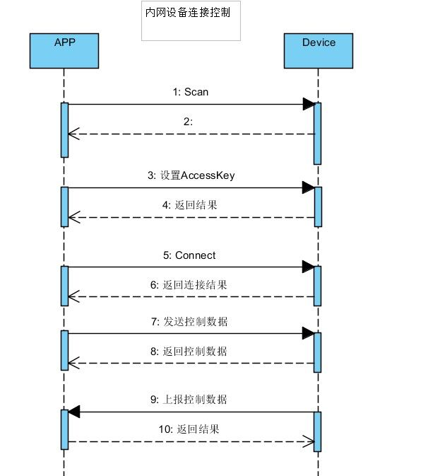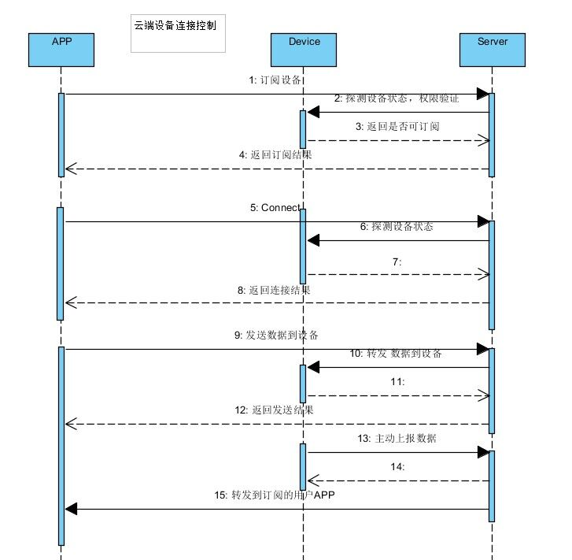

## <a name="step2" >二、为什么要用硬件模拟器？</a>
硬件模拟器可以模拟真实智能设备与云端及APP的通讯。无需为了开发App应用程序而购买硬件产品。你可以使设备模拟器来测试App和模拟设备之间的通信。 减少因硬件开发周期问题导致的App开发及设备对接问题。 缩短开发周期，提高App开发效率。

## <a name="step3" >三、如何使用？ </a>##

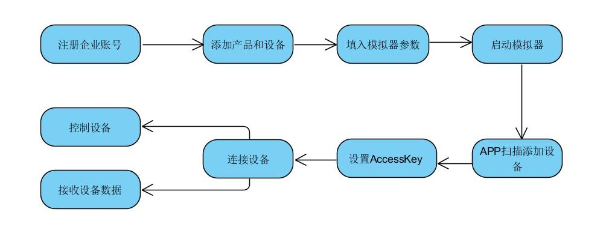
### <a name="step3.1" >3.1前期准备 </a>###
#### 3.1.1 注册或登录云智易平台账号 ####
1. 打开云智易开发者网站：[http://www.xlink.cn](http://www.xlink.cn)
2. 点击免费注册按钮或者登录按钮。
3. 输入注册信息进行注册或者登录信息进行登录。
4. 进入云智易企业管理后台。

#### 3.1.2 添加产品 ####
1. 点击云智易企业管理后台左侧菜单栏中的【添加产品】按钮。
2. 输入产品相关信息进行添加。

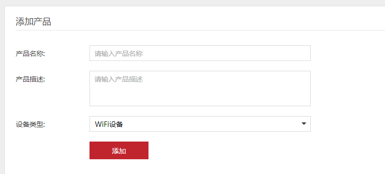

#### 3.1.3 添加设备 ####
1. 在企业管理后台左侧产品列表中点击上一步添加的产品。
2. 切换到【设备管理】标签，点击【添加设备】按钮，输入设备MAC地址，MAC地址在后续步骤中需要使用。

#### 3.1.4 设置数据端点 ####
1. 点击企业管理后台左侧上一步添加的产品列表。
2. 在右边子页面中点击【概览】可以查看产品PID和产品密钥，产品PID和产品密匙在后续步骤中需要使用。
3. 切换到【数据端点】标签，点击【添加数据端点】按钮，根据设备属性进行数据端点的添加。

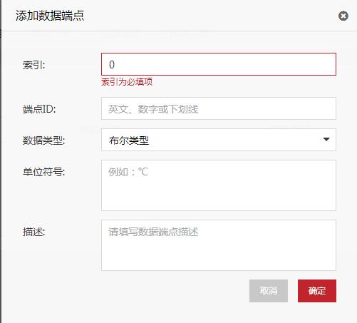

###  <a name="step3.2"> 3.2 硬件模拟器 </a> ###
#### 3.2.1 硬件模拟器下载与安装 ####
1. 硬件模拟器下载地址：
2. 下载解压后，点击【XLINKDeviceEMU.EXE】即可运行硬件模拟器。注意：安装文件中的配置文件不需要改动。

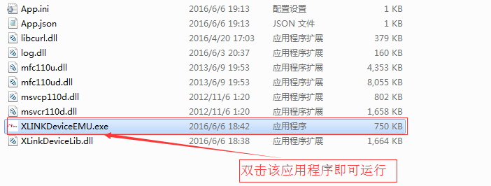
#### 3.2.2 硬件模拟器启动与断开  ####
1. 点击硬件模拟器图标，进入硬件模拟器主页。设备未启动时，【数据端点】的【设置端点值】按钮与【透传模式】的【发送】按钮不可点击。
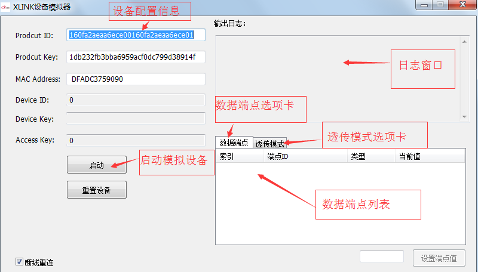
2. 在Product ID与Product key输入框中输入云智易企业管理平台->产品列表->概览中查看的产品ID与产品密钥。
3. 在MAC Address输入框中输入云智易企业管理平台->产品列表->设备管理中MAC地址。
4. 点击【启动】按钮，即可启动相应设备。启动设备之后，相应的产品ID、产品密钥、MAC地址不能修改。
5. 点击【断开】按钮，即可断开相应设备。并且可进行相关产品ID、产品密钥、MAC地址的修改。注：【断开】按钮需要启动设备之后才会出现。
6. 在【日志窗口】中可实时查看设备的相关反馈数据。并且该日志将以.log形式保存在程序安装文件夹中。
#### 3.2.3 透传APP连接 ####
1. 点击APP图标，输入企业ID、账号与密码，进入APP主页。
2. 进行设备扫描，扫描成功之后，输入设备AccessKey进行连接。
3. 操作APP，硬件模拟器日志窗口正确显示相关数据。并且硬件模拟器中的设备ID、设备密钥、设备使用权密钥的值设置为扫描到的设备的相应ID、密钥与使用权密钥。

#### 3.2.4 透传模式 ####
透传模式使用产商自定义的二进制数据协议来做设备的控制和状态反馈， 可定制性高、使用灵活。

1. 点击硬件模拟器主页中【透传模式】按钮。
2. 在透传模式输入框中输入需要发送数据。
3. 点击【发送】按钮，输入框中输入的数据会同步发送到所有连接的APP，并且可以在日志窗口中查看操作日志。
4. 若勾选16进制发送，则输入的数据以16进制格式发送。若不勾选则以字符串的形式发送。
5. 控制该设备的APP也正确显示发送与接收到的数据。

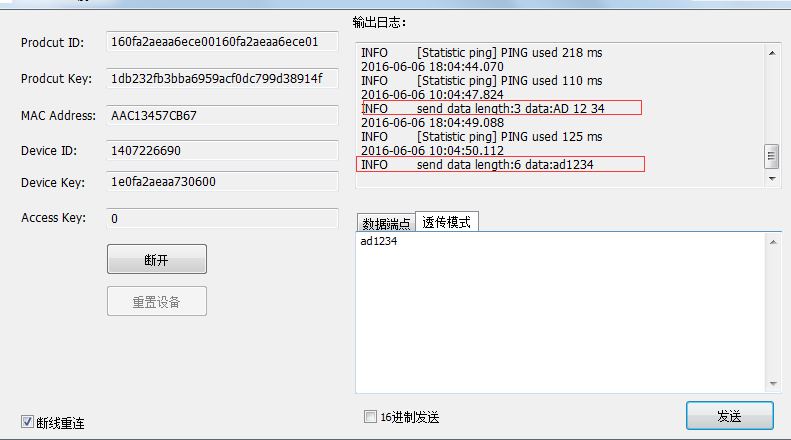
#### 3.2.5 数据端点模式 ####
数据端点使用云智易模板化的通讯协议，平台的很多SaaS功能需要结合数据端点来使用,比如报警推送，数据存储，设备快照。数据端点也可以被当做普通的控制协议来使用。

1. 设备启动之后，点击硬件模拟器主页中【数据端点】按钮。
2. 在数据端点列表中选择需要设置的数据端点。
3. 在数据端点输入框输入需要设置的数据。
4. 点击【设置端点值】按钮，模拟设备主动上报数据端点所设置的信息，设置的数据端点信息会同步发送到所有连接的手机APP和企业管理后台。并且日志窗口中可以查看到操作日志。

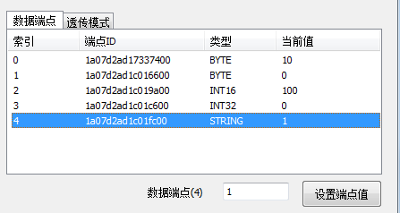
#### 3.2.6 重置设备 ####
重置设备会清除设备本地存储的deivce Id，device Key，AccessKey，并且会清除所有的订阅关系， 恢复到设备的出厂状态下。 操作步骤如下：

1. 断开设备后，可点击【重置设备】按钮。
2. deivce Id，device Key，AccessKey会自动变为初始状态。
注：当设备处于连接状态时，【重置设备】按钮不可点击。

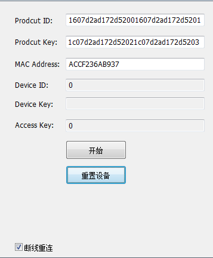

#### 3.2.7 断线重连 ####
断线重连功能主要用于网络断开时，模拟器自动重新连接服务器。程序默认开启，可以点击【断线重连】复选框取消断线重连功能。

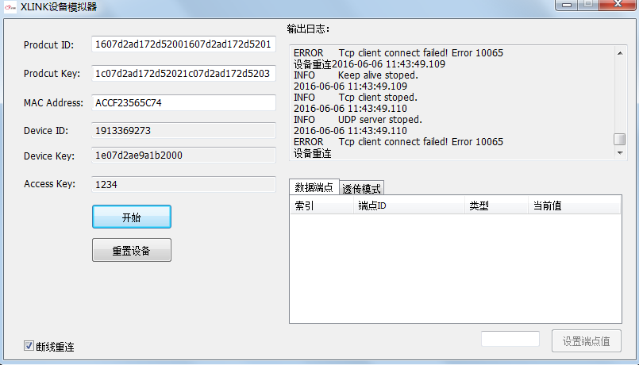
