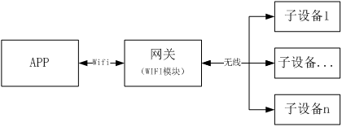

©2016  **云智易**物联云平台（http://www.xlink.cn）

# 设备通讯协议规范

## 1.概述

### 1.1目的
为厂商的智能硬件制定一个可靠、扩展性强和使用方便的通讯协议，并为Xlink的嵌入式SDK透传提供一个通讯协议。

###1.2系统结构图
####1.2.1网关模式
网关模式，由一个网关设备和一个或多个子设备组成的有线或无线局域网，并可通过网关进行管理和控制。

####1.2.1设备模式
设备模式，由一个或多个设备直接通过wifi网络连接到路由器组成的无线网络。

###1.3术语

* APP：指手机端或者云端设备；
* 网关：通常可以通过有线或无线连接到路由器，并作为APP和子设备之间数据交互的设备，并且可以管理和控制各个子设备；
* 子设备：子设备通常通过ZigBee或BLE等MESH网连接到有线或无线网关的设备；
* 设备：通常指可直接通过wifi或以太网连接到无线或有线路由器的设备；
* 特征/特征值：指产品的功能，一个特征对应一个产品功能，例如开关、亮度和色温等；
* 动作：指由多个特征组成的集合，每个特征都带有一个设定值；每执行一个动作，就是改变其特征值为设定值；
* 串口模式：这种模式下只提供wifi模组或芯片固件，通过串口外接MCU，开发者基于MCU通过串口指令来进行连网及收发数据。

### 1.4其他说明

* 协议数据排序都以高字节在前，低字节在后存储方式；
* 子设备与设备统称为Device；
* **此协议为云智易通用设备通讯协议，针对个别需求，可能只会用到其中某些指令，有些指令可能没用到**。

##2.通讯协议定义

* 通讯协议格式为：帧头 +指令+ 数据长度 + 流水号+地址+数据+校验+帧尾

注：加上帧头、帧尾和校验主要考虑作为网关时候串口通讯抗错能力。

###2.1协议帧格式

一个数据帧有如下格式组成：

帧头 | 指令| 数据长度 | 流水号 | 地址 | 数据 | 校验 | 帧尾
---- | ---- | ----| ---- | ----| ----| ----| ----
1字节（AA）| 2字节    | 2字节  | 2字节|N字节 |N字节 |1字节 | 1字节（55）

说明：

* 帧头：固定为0xAA。
* 指令：见如下指令定义；
* 数据长度：“流水号+地址+数据+校验+帧尾”的字节数；
* 流水号：通常用于区分响应帧数据是对应哪个发送帧，可以从0开始，然后加1循环使用。响应帧的流水好要与发送帧流水号一样，如果主动上报的数据可以自定义流水好，建议每发送一帧数据流水号加1即可；
* 地址：根据不同类型地址变化，地址类型见帧头定义；
* 数据：不确定，数据根据不同的控制指令变化；
* 校验：将“指令+数据长度+流水号+地址+数据”进行异或校验；
* 帧尾：固定为0x55。

###2.2指令定义

指令定义如下：

指令 |说明
---- | ----
Byte1 | Bit 7: 通讯方向【0表示请求/发送，1表示响应/上报】Bit6-0:通讯指令，见如下通讯指令表
Byte2 | Bit 7-5:地址类型【000B为无地址；001B为1字节地址；010B为短地址，2字节；011B为id地址，4字节；100B为6字节mac地址；101B为8字节mac地址；110B为16字节地址；111为保留】Bit 4-0:保留

通讯指令表：

|称|通讯指令|说明
---- | ---- | ----
注册|0x00|只适合子设备
查询设备属性|0x01|
查询或主动上报设备状态|0x02
设备控制|0x03
删除子设备/设备|0x04|
允许子设备加入网络/设备是否被发现|0x05|
保留|0x06-0x0F|
查询动作|0x10 |
添加动作|0x11|
修改动作|0x12|
删除动作|0x13|
执行动作|0x14|
动作快照|0x15|
保留|0x16-0x1F|
获取时间|0x20|
保留|0x21-0x2F|
查询定时器|x30|
添加定时器|0x31|
修改定时器|0x32|
删除定时器|0x33|
保留|0x34-0x5F|	
查询串口模式参数|0x60|只在串口模式下使用
修改串口模式参数|0x61|只在串口模式下使用
发送数据|0x62|只在串口模式下使用
接收数据|0x63|只在串口模式下使用
保留|0x64-0x7F|	

##3.通讯指令定义
**如下是各个通讯协议解析说明，在整个文档介绍中，地址类型为1字节，在实际应用中可以更换其他的地址类型，在本文档只是一个演示例子。**
###3.1注册（0x00）
  注册通讯指令一般是子设备备注册到平台上使用，需要把设备属性上报到平台，只适合子设备使用。

####3.1.1发送注册指令（Device -> APP）

帧头 | 指令| 数据长度 | 流水号 | 地址 | 数据 | 校验 | 帧尾
---- | ---- | ----| ---- | ----| ----| ----| ----
AA	|00 20|xx xx|00 00|01|xx|xx	|55
指令说明：

指令 | 说明
---- | ----
Byte1 | Bit 7: 0；Bit 6-0:0000000
Byte2 | Bit 7-5:001，为1字节地址；Bit 4-0:00000

数据说明：

设备属性数据协议格式（可支持多个属性）:

属性1 | 属性... |	属性N
---- | ---- | ---- | ---- | ----
特征(1字节)+长度(1字节)+数值(n字节) | ... | ...
长度：每个数值的字节数。

属性特征表定义如下：

<a name="设备属性">设备属性特征表</a>

特征名称|特征码（16进制）|数值|说明
---- | ---- | ---- | ----
协议版本|	00|	0-65535|	2字节
产品ID	|01	|字符串|	32字节
产品类型|	02|	[附录A](#附录A)|	2字节
设备固件版本|	03|	0-65535|	2字节
设备MAC地址|	04|	自定义|	6或8字节，设备固化，一般为全球唯一
设备地址	|05|	自定义|	0-16字节，一般用于通讯，可能会改变
设备名称|	06	|字符串|	1-24字节|
保留	|07-FF|	--	|--

####3.1.2返回注册结果（APP -> Device）

帧格式：

帧头 | 指令| 数据长度 | 流水号 | 地址 | 数据 | 校验 | 帧尾
---- | ---- | ----| ---- | ----| ----| ----| ----
AA	|80 20	|xx xx|	00 00|	01|	1字节|	xx|	55

指令说明：

指令 | 说明
---- | ----
Byte1|	Bit 7: 1;Bit 6-0:0000000
Byte2|	Bit 7-5:001，为1字节地址;Bit 4-0:00000

数据说明：

数据|	说明
---- | ----
Byte1|	00表示成功，1表示失败，其他保留

###3.2查询设备属性（0x01）

查询通讯指令可以获取指定设备的属性。
当在网关模式下，不知任何子设备地址时来查询设备，可将地址设为最大值（如地址长度为1字节时，为0xFF），返回结果将返回逐个设备属性。
####3.2.1发送查询设备属性指令（APP -> Device）

帧格式：

帧头 | 指令| 数据长度 | 流水号 | 地址 | 数据 | 校验 | 帧尾
---- | ---- | ----| ---- | ----| ----| ----| ----
AA	|01 20|	xx xx|	00 00|	01|	N字节|	xx|	55
指令说明：

指令 | 说明
---- | ----
Byte1|	Bit 7: 0;Bit 6-0:0000001
Byte2|	Bit 7-5:001，为1字节地址;Bit 4-0:00000

数据说明：

**情况1：**
如果数据为空时，返回结果将返回所有特征码。

**情况2：**
查询指定特征码，同时可以查询多个特征码，数据如下：

特征码1 | 特征码... |	特征码N
---- | ---- | ----
1字节|1字节|1字节

####3.2.2返回查询结果（Device -> APP）

帧格式：

帧头 | 指令| 数据长度 | 流水号 | 地址 | 数据 | 校验 | 帧尾
---- | ---- | ----| ---- | ----| ----| ----| ----
AA	|81 20|	xx xx|	00 00|	01	|N字节|	xx|	55

指令说明：

指令 | 说明
---- | ----
Byte1|	Bit 7: 1;Bit 6-0:0000001
Byte2|	Bit 7-5:001，为1字节地址;Bit 4-0:00000

数据说明：

设备属性数据协议格式（可同时返回多个属性，属性见[设备属性特征表](#设备属性)）:

属性1 | 属性... |	属性N
---- | ---- | ----
特征(1字节)+长度(1字节)+数值(n字节) | ... | ...
长度：每个特征对应数值的字节数。

###3.3查询或主动上报设备状态（0x02）

用于查询设备工作状态，或者设备工作状态改变后主动上报。

####3.3.1发送查询设备状态指令（APP -> Device）

帧格式：

帧头 | 指令| 数据长度 | 流水号 | 地址 | 数据 | 校验 | 帧尾
---- | ---- | ----| ---- | ----| ----| ----| ----
AA	|02 20|	xx xx|	00 00|	01|	无|	xx|	55
指令说明：

指令 | 说明
---- | ----
Byte1|	Bit 7: 0;Bit 6-0:0000010
Byte2|	Bit 7-5:001，为1字节地址;Bit 4-0:00000

####3.3.2返回结果或主动上报（Device -> APP）

帧格式：

帧头 | 指令| 数据长度 | 流水号 | 地址 | 数据 | 校验 | 帧尾
---- | ---- | ----| ---- | ----| ----| ----| ----
AA	|82 20|	xx xx|	00 00|	01|	N字节|	xx|	55
指令说明：

指令 | 说明
---- | ----
Byte1|	Bit 7: 1;Bit 6-0:0000010
Byte2|	Bit 7-5:001，为1字节地址;Bit 4-0:00000

数据说明：
设备控制状态数据协议格式（可同时返回多个状态）:

状态1 | 状态... |	状态N    
---- | ---- | ----
特征(1字节)+长度(1字节)+数值(n字节) | ... | ...
长度：每个特征对应数值的字节数。
不同的设备对应不同的特征表（见[附录B](#附录B)）。

###3.4设备控制（0x03）
对设备状态进行设置或控制，即改变每个设备的特征值。返回的结果只是是否执行成功，如果需要上报设备状态，可使用“主动上报设备指令”上报。
####3.4.1发送控制指令（APP -> Device）
帧格式：

帧头 | 指令| 数据长度 | 流水号 | 地址 | 数据 | 校验 | 帧尾
---- | ---- | ----| ---- | ----| ----| ----| ----
AA	|03 20|	xx xx|	00 00|	01|	N字节|	xx|	55
指令说明：

指令 | 说明
---- | ----
Byte1|	Bit 7: 0;Bit 6-0:0000011
Byte2|	Bit 7-5:001，为1字节地址;Bit 4-0:00000

数据说明：

设备控制状态数据协议格式（可同时支持多个属性，不同的设备对应不同的特征表，设备特征表见[附录B](#附录B)）:

状态1 | 状态... |状态N
---- | ---- | ----
特征(1字节)+长度(1字节)+数值(n字节) | ... | ...
长度：每个特征对应数值的字节数。
####3.4.2返回控制结果（Device -> APP）
帧格式：

帧头 | 指令| 数据长度 | 流水号 | 地址 | 数据 | 校验 | 帧尾
---- | ---- | ----| ---- | ----| ----| ----| ----
AA	|83 20|	xx xx|	00 00|	01|	1字节|	xx|	55
指令说明：

指令 | 说明
---- | ----
Byte1|	Bit 7: 0;Bit 6-0:0000011
Byte2|	Bit 7-5:001，为1字节地址;Bit 4-0:00000

数据说明：

数据	|说明
---- | ----
Byte1	|00表示成功，1表示失败，其他保留

###3.5删除子设备/设备（0x04）

当在删除子设备或设备时候使用，删除设备或子设备时，通常会恢复出厂状态。

####3.5.1发送删除子设备/设备指令（APP -> Device）
帧格式：

帧头 | 指令| 数据长度 | 流水号 | 地址 | 数据 | 校验 | 帧尾
---- | ---- | ----| ---- | ----| ----| ----| ----
AA	|04 20|	xx xx|	00 00|	01|	1字节|	xx|	55

指令说明：

指令 | 说明
---- | ----
Byte1|	Bit 7: 0;Bit 6-0:0000100
Byte2|	Bit 7-5:001，为1字节地址;Bit 4-0:00000

数据说明：

数据	|说明
---- | ----
Byte1   |1字节，1表示删除，其他保留

####3.5.2返回删除子设备/设备结果（Device -> APP）
帧格式：

帧头 | 指令| 数据长度 | 流水号 | 地址 | 数据 | 校验 | 帧尾
---- | ---- | ----| ---- | ----| ----| ----| ----
AA	|84 20|	xx xx|	00 00|	01|	1字节|	xx|	55

指令说明：

指令 | 说明
---- | ----
Byte1|	Bit 7: 1;Bit 6-0:0000100
Byte2|	Bit 7-5:001，为1字节地址;Bit 4-0:00000

数据说明：

数据	|说明
---- | ----
Byte1	|00表示成功，1表示失败，其他保留

###3.6允许子设备加入网络/设备是否被发现（0x05）

网关模式，当网关允许时候，子设备才能加入网络。单品模式下，设置设备是否被扫描（发现）状态。

####3.6.1发送允许子设备加入网络/设备是否被发现指令（APP -> Device）

帧格式：

帧头 | 指令| 数据长度 | 流水号 | 地址 | 数据 | 校验 | 帧尾
---- | ---- | ----| ---- | ----| ----| ----| ----
AA	|05 20|	xx xx|	00 00|	01|	1字节|	xx|	55

指令说明：

指令 | 说明
---- | ----
Byte1|	Bit 7: 0;Bit 6-0:00001001
Byte2|	Bit 7-5:001，为1字节地址;Bit 4-0:00000

数据说明：

数据	|说明
---- | ----
Byte1   |1字节，0表示关，1表示开，其他保留

####3.6.2返回允许子设备加入网络/设备是否被发现结果（Device -> APP）

帧格式：

帧头 | 指令| 数据长度 | 流水号 | 地址 | 数据 | 校验 | 帧尾
---- | ---- | ----| ---- | ----| ----| ----| ----
AA	|85 20|	xx xx|	00 00|	01|	1字节|	xx|	55

指令说明：

指令 | 说明
---- | ----
Byte1|	Bit 7: 1;Bit 6-0:00001001
Byte2|	Bit 7-5:001，为1字节地址;Bit 4-0:00000

数据说明：

数据	|说明
---- | ----
Byte1|	00表示成功，1表示失败，其他保留

###3.7查询动作（0x10）

动作一般会存储到设备上，会有一个或多个特征组成。每个动作都有一个ID编号，且这个编号在同一个局域网络内是唯一的。
当查询当前设备所有动作时，编号ID为最大值（0xFF），返回结果将逐个返回设备上存在的动作。

####3.7.1发送查询动作指令（APP -> Device）

帧格式：

帧头 | 指令| 数据长度 | 流水号 | 地址 | 数据 | 校验 | 帧尾
---- | ---- | ----| ---- | ----| ----| ----| ----
AA	|10 20|	xx xx|	00 00|	01|	1字节|	xx|	55
指令说明：

指令 | 说明
---- | ----
Byte1|	Bit 7: 0;Bit 6-0:0010000
Byte2|	Bit 7-5:001，为1字节地址;Bit 4-0:00000

数据说明：

数据	|说明
---- | ----
Byte1|	表示动作ID编号

####3.7.2返回查询动作结果（Device -> APP）

帧格式：

帧头 | 指令| 数据长度 | 流水号 | 地址 | 数据 | 校验 | 帧尾
---- | ---- | ----| ---- | ----| ----| ----| ----
AA	|90 20|	xx xx|	00 00|	01|	N字节|	xx|	55

指令说明：

指令 | 说明
---- | ----
Byte1|	Bit 7: 1;Bit 6-0:0010000
Byte2|	Bit 7-5:001，为1字节地址;Bit 4-0:00000

数据说明：
情况1：当查询ID号为0xFF返回
表示获取设备所有的ID编号，主要功能：告诉查询者设备当前有哪些ID编号。

ID编号|	ID编号1|	ID编号...|	ID编号n
---- | ---- | ---- | ----
1字节（FF）|	1字节|	1字节|	1字节

情况2：当查询ID号小于0xFF返回

ID编号	|设备特征1|	设备特征...|	设备特征n
---- | ---- | ---- | ----
1字节	|特征(1字节)+长度(1字节)+数值(n字节)|	N字节|	N字节

###3.8添加动作（0x11）

向设备添加一个动作，需要带上动作ID编号。

####3.8.1发送添加动作指令（APP -> Device）

帧格式：

帧头 | 指令| 数据长度 | 流水号 | 地址 | 数据 | 校验 | 帧尾
---- | ---- | ----| ---- | ----| ----| ----| ----
AA	|11 20|	xx xx|	00 00|	01|	N字节|	xx|	55
指令说明：

指令 | 说明
---- | ----
Byte1|	Bit 7: 0;Bit 6-0:0010001
Byte2|	Bit 7-5:001，为1字节地址;Bit 4-0:00000

数据说明：

ID编号	|设备特征1|	设备特征...|	设备特征n
---- | ---- | ---- | ----
1字节	|特征(1字节)+长度(1字节)+数值(n字节)|	N字节|	N字节
每个设备的特征表见附录B。

####3.8.2返回添加动作结果（Device -> APP）

帧格式：

帧头 | 指令| 数据长度 | 流水号 | 地址 | 数据 | 校验 | 帧尾
---- | ---- | ----| ---- | ----| ----| ----| ----
AA	|91 20|	xx xx|	00 00|	01|	1字节|	xx|	55
指令说明：

指令 | 说明
---- | ----
Byte1|	Bit 7: 1;Bit 6-0:0010001
Byte2|	Bit 7-5:001，为1字节地址;Bit 4-0:00000
数据说明：

数据|说明
---- | ----
Byte1|	0表示成功，1表示已经满，2表示已经存在，3表示其他失败，其他保留

###3.9修改动作（0x12）

修改设备上指定的动作。

####3.9.1发送修改动作指令（APP -> Device）

帧格式：

帧头 | 指令| 数据长度 | 流水号 | 地址 | 数据 | 校验 | 帧尾
---- | ---- | ----| ---- | ----| ----| ----| ----
AA	|12 20|	xx xx|	00 00|	01|	N字节|	xx|	55

指令说明：

指令 | 说明
---- | ----
Byte1|	Bit 7: 0;Bit 6-0:0010010
Byte2|	Bit 7-5:001，为1字节地址;Bit 4-0:00000

数据说明：

ID编号	|设备特征1|	设备特征...|	设备特征n
---- | ---- | ----| ----
1字节|特征(1字节)+长度(1字节)+数值(n字节)|	N字节|N字节		

每个设备的特征表见附录B。

####3.9.2返回修改动作结果（Device -> APP）

帧格式：

帧头 | 指令| 数据长度 | 流水号 | 地址 | 数据 | 校验 | 帧尾
---- | ---- | ----| ---- | ----| ----| ----| ----
AA	|92 20|	xx xx|	00 00|	01	|1字节|	xx|	55

指令说明：

指令 | 说明
---- | ----
Byte1|	Bit 7: 1;Bit 6-0:0010010
Byte2|	Bit 7-5:001，为1字节地址;Bit 4-0:00000

数据说明：

数据|说明
---- | ----
Byte1|	00表示成功，1表示失败，其他保留

###3.10删除动作（0x13）

删除设备上指定的动作。

####3.10.1发送删除动作指令（APP -> Device）

帧格式：

帧头 | 指令| 数据长度 | 流水号 | 地址 | 数据 | 校验 | 帧尾
---- | ---- | ----| ---- | ----| ----| ----| ----
AA	|13 20|	xx xx|	00 00|	01|	1字节|	xx|	55

指令说明：

指令 | 说明
---- | ----
Byte1|	Bit 7: 0;Bit 6-0:0010011
Byte2|	Bit 7-5:001，为1字节地址;Bit 4-0:00000

数据说明：

数据|说明
---- | ----
Byte1|	表示要删除的动作ID编号

####3.10.2返回删除动作结果（Device -> APP）

帧格式：

帧头 | 指令| 数据长度 | 流水号 | 地址 | 数据 | 校验 | 帧尾
---- | ---- | ----| ---- | ----| ----| ----| ----
AA	93| 20|	xx xx|	00 00|	01|	1字节|	xx|	55

指令说明：

指令 | 说明
---- | ----
Byte1|	Bit 7: 1;Bit 6-0:0010011
Byte2|	Bit 7-5:001，为1字节地址;Bit 4-0:00000

数据说明：

数据|说明
---- | ----
Byte1|	00表示成功，1表示失败，其他保留

###3.11执行动作（0x14）

执行设备上指定的动作。

####3.11.1发送执行动作指令（APP -> Device）

帧格式：

帧头 | 指令| 数据长度 | 流水号 | 地址 | 数据 | 校验 | 帧尾
---- | ---- | ----| ---- | ----| ----| ----| ----
AA	|14 20|	xx xx|	00 00|	01|	1字节|	xx|	55

指令说明：

指令 | 说明
---- | ----
Byte1|	Bit 7: 0;Bit 6-0:0010100
Byte2|	Bit 7-5:001，为1字节地址;Bit 4-0:00000

数据说明：

数据|说明
---- | ----
Byte1|表示要执行的动作ID编号

####3.11.2返回执行动作结果（Device -> APP）

帧格式：

帧头 | 指令| 数据长度 | 流水号 | 地址 | 数据 | 校验 | 帧尾
---- | ---- | ----| ---- | ----| ----| ----| ----
AA	|74 20|	xx xx|	00 00|	01|	1字节|	xx|	55

指令说明：

指令 | 说明
---- | ----
Byte1|	Bit 7: 1;Bit 6-0:0010100
Byte2|	Bit 7-5:001，为1字节地址;Bit 4-0:00000

数据说明：

数据|说明
---- | ----
Byte1|	00表示成功，1表示失败，其他保留

###3.12动作快照（0x15）

分配一个动作ID号给设备，设备把当前的设备状态存储到此编号作为一个动作。

####3.12.1发送动作快照指令（APP -> Device）

帧格式：

帧头 | 指令| 数据长度 | 流水号 | 地址 | 数据 | 校验 | 帧尾
---- | ---- | ----| ---- | ----| ----| ----| ----
AA	|15 20|	xx xx|	00 00|	01|	1字节|	xx|	55

指令说明：

指令 | 说明
---- | ----
Byte1|	Bit 7: 0;Bit 6-0:0010001
Byte2|	Bit 7-5:001，为1字节地址;Bit 4-0:00000

数据说明：

数据|说明
---- | ----
Byte1|	表示快照存储的动作ID编号

####3.12.2返回动作快照结果（Device -> APP）

帧格式：

帧头 | 指令| 数据长度 | 流水号 | 地址 | 数据 | 校验 | 帧尾
---- | ---- | ----| ---- | ----| ----| ----| ----
AA	|95 20|	xx xx|	00 00|	01|	1字节|	xx|	55

指令说明：

指令 | 说明
---- | ----
Byte1|	Bit 7: 1;Bit 6-0:0010001
Byte2|	Bit 7-5:001，为1字节地址;Bit 4-0:00000

数据说明：

数据|说明
---- | ----
Byte1|	00表示成功，1表示失败，其他保留

###3.13获取时间（0x20）

设备向APP获取当前时间。

####3.13.1发送获取指令（Device -> APP）

帧格式：

帧头 | 指令| 数据长度 | 流水号 | 地址 | 数据 | 校验 | 帧尾
---- | ---- | ----| ---- | ----| ----| ----| ----
AA	|20 20|	xx xx|	00 00|	01|	无|	xx|	55

指令说明：

指令 | 说明
---- | ----
Byte1|	Bit 7: 0;Bit 6-0:0100000
Byte2|	Bit 7-5:001，为1字节地址;Bit 4-0:00000

####3.13.2返回获取时间结果（APP -> Device）

帧格式：

帧头 | 指令| 数据长度 | 流水号 | 地址 | 数据 | 校验 | 帧尾
---- | ---- | ----| ---- | ----| ----| ----| ----
AA	|A0 20|	xx xx|	00 00|	01|	8字节|	xx|	55

指令说明：

指令 | 说明
---- | ----
Byte1|	Bit 7: 1;Bit 6-0:0100000
Byte2|	Bit 7-5:001，为1字节地址;Bit 4-0:00000

数据说明：

年	|月	|日	|时	|分	|秒	|周
---- | ---- | ----| ---- | ----| ----| ----
2字节|	1字节|	1字节|	1字节|	1字节|	1字节|	1字节
周说明：bit0-6表示周日一二三四五六，bit7保留。

###3.14查询定时器（0x30）

查询设备上存在的定时器，每个定时器都有一个ID编号，且这个编号在同一个局域网络内是唯一的。
当查询当前设备所有定时器时，编号ID为最大值（0xFF），返回结果将逐个返回设备上存在的定时器。

####3.14.1发送查询定时器指令（APP -> Device）

帧格式：

帧头 | 指令| 数据长度 | 流水号 | 地址 | 数据 | 校验 | 帧尾
---- | ---- | ----| ---- | ----| ----| ----| ----
AA	|30 20|	xx xx|	00 00|	01|	1字节|	xx|	55

指令说明：

指令 | 说明
---- | ----
Byte1|	Bit 7: 0;Bit 6-0:0110000
Byte2|	Bit 7-5:001，为1字节地址;Bit 4-0:00000

数据说明：

数据|说明
---- | ----
Byte1|	表示定时器ID编号

####3.14.2返回查询定时器结果（Device -> APP）

帧格式：

帧头 | 指令| 数据长度 | 流水号 | 地址 | 数据 | 校验 | 帧尾
---- | ---- | ----| ---- | ----| ----| ----| ----
AA	|B0 20|	xx xx|	00 00|	01|	N字节|	xx|	55

指令说明：

指令 | 说明
---- | ----
Byte1|	Bit 7: 1;Bit 6-0:0110000
Byte2|	Bit 7-5:001，为1字节地址;Bit 4-0:00000

数据说明：

情况1：当查询ID号为0xFF返回
表示获取设备所有的ID编号，主要功能：告诉查询者设备当前有哪些ID编号。

ID编号|	ID编号1	|ID编号...|	ID编号n
---- | ---- | ----| ----
1字节（FF）|	1字节|	1字节|	1字节

情况2：当查询ID号小于0xFF返回

ID编号	|动作ID编号|	定时时间数据
---- | ---- | ----
1字节	|1字节	|特征(1字节)+特征长度(1字节)+数值(N字节)

定时器特征表见下表，如果数据长度为0表示设备没有存在的定时器。
定时器特征表如下：

特征名称|	特征码（16进制）|	数值|	说明
---- | ---- | ----| ----
使能	|00	|00表示不使能，1表示使能，其他保留	|1字节，使能后才会执行
单次定时（周）|	01|	周、时、分|3字节；周字节表示：bit0-6表示周日一二三四五六，bit7保留，如下周表示相同
单次定时（日期）|	02	|年月日时分|	6字节
循环定时（周）	|03	|周、时、分|	3字节
保留|	04-FF|	--|	--

注：使能特征码需要与大于0的特征码使用，大于0的特征码只能单个出现，不能多个出现。

###3.15添加定时器（0x31）

添加一个新定时器。

####3.15.1发送添加定时器指令（APP -> Device）

帧格式：

帧头 | 指令| 数据长度 | 流水号 | 地址 | 数据 | 校验 | 帧尾
---- | ---- | ----| ---- | ----| ----| ----| ----
AA	|31 20|	xx xx|	00 00|	01|	N字节|	xx|	55

指令说明：

指令 | 说明
---- | ----
Byte1|	Bit 7: 0;Bit 6-0:0110001
Byte2|	Bit 7-5:001，为1字节地址;Bit 4-0:00000

数据说明：

ID编号	|动作ID编号|	定时时间数据
---- | ---- | ----
1字节	|1字节	|特征(1字节)+特征长度(1字节)+数值(N字节)

定时器特征表见表3-2。

####3.15.2返回添加定时器结果（Device -> APP）

帧格式：

帧头 | 指令| 数据长度 | 流水号 | 地址 | 数据 | 校验 | 帧尾
---- | ---- | ----| ---- | ----| ----| ----| ----
AA	|B1 20|	xx xx|	00 00|	01|	1字节|	xx|	55

指令说明：

指令 | 说明
---- | ----
Byte1|	Bit 7: 1;Bit 6-0:0110001
Byte2|	Bit 7-5:001，为1字节地址;Bit 4-0:00000

数据说明：

数据|说明
---- | ----
Byte1|	0表示成功，1表示已经满，2表示已经存在，3表示其他失败，其他保留

###3.16修改定时器（0x32）

####3.16.1发送修改定时器指令（APP -> Device）

帧格式：

帧头 | 指令| 数据长度 | 流水号 | 地址 | 数据 | 校验 | 帧尾
---- | ---- | ----| ---- | ----| ----| ----| ----
AA	|32 20|	xx xx|	00 00|	01|	N字节|	xx|	55

指令说明：

指令 | 说明
---- | ----
Byte1|	Bit 7: 0;Bit 6-0:0110010
Byte2|	Bit 7-5:001，为1字节地址;Bit 4-0:00000

数据说明：

ID编号	|动作ID编号|	定时时间数据
---- | ---- | ----
1字节	|1字节	|特征(1字节)+特征长度(1字节)+数值(N字节)

定时器特征表见表3-2。

####3.16.2返回修改定时器结果（Device -> APP）

帧格式：

帧头 | 指令| 数据长度 | 流水号 | 地址 | 数据 | 校验 | 帧尾
---- | ---- | ----| ---- | ----| ----| ----| ----
AA	|B2 20|	xx xx|	00 00|	01|	1字节|	xx|	55

指令说明：

指令 | 说明
---- | ----
Byte1|	Bit 7: 1;Bit 6-0:0110010
Byte2|	Bit 7-5:001，为1字节地址;Bit 4-0:00000

数据说明：

数据|说明
---- | ----
Byte1|	00表示成功，1表示失败，其他保留

###3.17删除定时器（0x33）
删除指定定时器。
####3.17.1发送删除定时器指令（APP -> Device）

帧格式：

帧头 | 指令| 数据长度 | 流水号 | 地址 | 数据 | 校验 | 帧尾
---- | ---- | ----| ---- | ----| ----| ----| ----
AA	|33 20|	xx xx|	00 00|	01|	N字节|	xx|	55

指令说明：

指令 | 说明
---- | ----
Byte1|	Bit 7: 0;Bit 6-0:0110011
Byte2|	Bit 7-5:001，为1字节地址;Bit 4-0:00000

数据说明：

数据|说明
---- | ----
Byte1|	表示要删除的定时器ID编号

注意，设备在删除定时器时，需要同时删除定时器对应的动作。

####3.17.2返回删除定时器结果（Device -> APP）

帧格式：

帧头 | 指令| 数据长度 | 流水号 | 地址 | 数据 | 校验 | 帧尾
---- | ---- | ----| ---- | ----| ----| ----| ----
AA	|B3 20|	xx xx|	00 00|	01|	1字节|	xx|	55

指令说明：

指令 | 说明
---- | ----
Byte1|	Bit 7: 1;Bit 6-0:0110011
Byte2|	Bit 7-5:001，为1字节地址;Bit 4-0:00000

数据说明：

数据|说明
---- | ----
Byte1|	00表示成功，1表示失败，其他保留

###3.18查询串口模式参数（0x60）

此指令只在串口透传模式下使用，需要配套透传固件使用，主要读取和配置模组参数。

**注：3.18指令暂没开放使用，不能使用，请忽略。**

####3.18.1	发送查询串口模式参数指令（MCU -> Device）

帧格式：

帧头 | 指令| 数据长度 | 流水号 | 地址 | 数据 | 校验 | 帧尾
---- | ---- | ----| ---- | ----| ----| ----| ----
AA	|60 20	|xx xx|	00 00|	01	|N字节|	xx	|55

指令说明：

指令 | 说明
---- | ----
Byte1|	Bit 7: 0;Bit 6-0:1100000
Byte2|	Bit 7-5:001，为1字节地址;Bit 4-0:00000

数据说明：

数据格式如下表，字节数可变，数据内容填写需要查询的特征码，见表3.3。如果数据内容为一字节的0xFF，表示查询所有可读特征内容。

数据	|说明
---- | ----
Byte1|需查询的特征码
Byte...|需查询的特征码
ByteN|需查询的特征码

  表3.3  串口参数特征表

特征名称|特征码（16进制）|读/写|数值|说明
---- | ---- | ---- | ---- | ----
名称|00|读/写|N 字节|最多字节数为32字节
固件版本|01|读|2字节|
设备类型|02|读|2字节|
产品ID|03|读/写|32字节|从平台上获得
产品KEY|04|读/写|32字节|从平台上获得
MAC地址|05|读/写|6字节|
被扫描发现模式|06|读/写|1字节，0表示关闭，1表示开，其他保留|
波特率|07|读/写|2字节|第一字节定义：0-7表示1200、2400、4800、9600、19200、38400、57600、115200，其他保留，默认为115200；第二字节保留
连接状态|08|读|2字节|第一字节表示wifi连接状态，第二字节表示服务器连接状态；0表示断开，1表示连接，其他保留
当前时间|09|读|10字节，分别为年、月、日、周、时、分、秒、时区|其中年和时区为2字节，其他都为1字节；周字节中，bit0-6分别表示日一二三四五六，bit7保留
Wifi模式|0A|读/写|1字节，0表示AP模式，1表示STA模式，2表示AP+STA模式，其他保留|默认为AP模式
进入配网模式|0B|写|1字节，0表示进入配网，其他保留|	
域名|0C|读/写|N字节|最多32字节
设置所有数据端点数据|10|写|N 字节|最多字节数为800字节
更新单个或多个数据端点数据|11|写|1字节警告开关+N 字节数据|最多字节数为800字节；告警开关，0表示推送告警，其他表示不推送
接收远程数据端点|12|读|N 字节|最多字节数为800字节
重启设备|F0|写|1字节，0表示重启，其他保留|	
重置设备|F1|写|1字节，0表示重置，其他保留|	
保留|除以上特征码外|--|--	|--

####3.18.2	返回查询串口模式参数结果或主动下发网络状态变化结果（Device -> MCU）

帧格式：

帧头 | 指令| 数据长度 | 流水号 | 地址 | 数据 | 校验 | 帧尾
---- | ---- | ----| ---- | ----| ----| ----| ----
AA	|E0 20	|xx xx|	00 00|	01 |N字节|	xx	|55

指令说明：

指令 | 说明
---- | ----
Byte1|	Bit 7: 0;Bit 6-0:1100000
Byte2|	Bit 7-5:001，为1字节地址;Bit 4-0:00000

数据说明：

数据格式如下，返回查询的特征码内容，串口模式特征表如所示表3.3所示。

设备特征1|设备特征...|设备特征n
---- | ---- | ----
特征（1字节）+长度（1字节）+数值(N字节)|N字节|N字节

###3.19	设置串口模式参数（0x61）

设置串口模式配置参数。

####3.19.1	发送设置串口模式参数指令（MCU -> Device）

帧格式：

帧头 | 指令| 数据长度 | 流水号 | 地址 | 数据 | 校验 | 帧尾
---- | ---- | ----| ---- | ----| ----| ----| ----
AA	|61 20	|xx xx|	00 00|	01	|N字节|	xx	|55

指令说明：

指令 | 说明
---- | ----
Byte1|	Bit 7: 0;Bit 6-0:1100001
Byte2|	Bit 7-5:001，为1字节地址;Bit 4-0:00000

数据说明：

设备特征1|设备特征...|设备特征n
---- | ---- | ----
特征（1字节）+长度（1字节）+数值(N字节)|N字节|N字节

####3.19.2	返回设置串口模式参数结果（Device -> MCU）

帧格式：

帧头 | 指令| 数据长度 | 流水号 | 地址 | 数据 | 校验 | 帧尾
---- | ---- | ----| ---- | ----| ----| ----| ----
AA	|E1 20	|xx xx|	00 00|	01	|1字节|	xx	|55

指令说明：

指令 | 说明
---- | ----
Byte1|	Bit 7: 1;Bit 6-0:1100001
Byte2|	Bit 7-5:001，为1字节地址;Bit 4-0:00000

数据说明：

数据|说明
---- | ----
Byte1 | 00表示成功，1表示失败，其他保留

注：如设置多个特征，如果有一个错误将返回失败，但正确的特征数据会被设置成功。

###3.20	串口模式发送数据（0x62）

MCU发送数据，发送数据后需要等待结果才能发送第二包数据。

####3.20.1	发送串口模式发送数据指令（MCU -> Device）

帧格式：

帧头 | 指令| 数据长度 | 流水号 | 地址 | 数据 | 校验 | 帧尾
---- | ---- | ----| ---- | ----| ----| ----| ----
AA	|62 20	|xx xx	|00 00|	01	|N字节|	xx	|55

指令说明：

指令 | 说明
---- | ----
Byte1|	Bit 7: 0;Bit 6-0:1100010
Byte2|	Bit 7-5:001，为1字节地址;Bit 4-0:00000

数据说明：

数据内容如下表。

数据|说明
---- | ----
Byte1|表示模式：0表示发送UDP数据，1表示发送TCP数据，2表示发送UDP和TCP数据（这种模式下，），其他保留
Byte2-5|表示地址，用作一个int表示；当UDP模式发送数据时，此值为0xFFFF(255.255.255.255)表示发送给所有客户端设备，否则发送给个客户端设备；当TCP发送数据时，用作表示发送给指定客户端的设备ID，这4个字节如果为-1表示发送给所有客户端，否则发送指定ID的客户端
Byte6-ByteN|数据内容

####3.20.2	返回串口模式发送数据结果（Device -> MCU）

帧格式：

帧头 | 指令| 数据长度 | 流水号 | 地址 | 数据 | 校验 | 帧尾
---- | ---- | ----| ---- | ----| ----| ----| ----
AA	|E2 20	|xx xx|	00 00|	01	|1字节|	xx	|55

指令说明：

指令 | 说明
---- | ----
Byte1|	Bit 7: 1;Bit 6-0:1100010
Byte2|	Bit 7-5:001，为1字节地址;Bit 4-0:00000

数据说明：

数据|说明
---- | ----
Byte1|00表示成功，1表示wifi没连接网络，2表示wifi忙状态，其他保留

###3.21	串口模式接收数据（0x63）

MCU接收UDP或者TCP客户端数据，无需响应。

####3.21.1	发送串口模式接收数据指令（Device -> MCU）

帧格式：

帧头 | 指令| 数据长度 | 流水号 | 地址 | 数据 | 校验 | 帧尾
---- | ---- | ----| ---- | ----| ----| ----| ----
AA	|63 20	|xx xx|	00 00|	01|	N字节|	xx|	55

指令说明：

指令 | 说明
---- | ----
Byte1|	Bit 7: 0;Bit 6-0:1100011
Byte2|	Bit 7-5:001，为1字节地址;Bit 4-0:00000

数据说明：

数据内容如下表。

数据|说明
---- | ----
Byte1|表示模式：0表示UDP发送数据，1表示TCP发送数据，其他保留
Byte2-5|表示int类型；当UDP模式发送数据，255.255.255.255表示发送给所有客户端设备，否则发送给个客户端设备；当TCP发送数据，表示客户端设备ID，这4个字节如果为-1表示发送给所有客户端，否则发送指定的客户端
Byte6-ByteN|数据内容

##<a name="附录A">附录A 产品类型定义</a>
产品类型有两字节组成，第一个字节表示产品分类，第二字节为产品型号，如下表：

分类|名称|编码（16进制）|	说明
---- | ---- | ---- | ----
网关类|网关|0x0000|
网关类|保留|0x0001-0x00FF|
照明类|开关灯|0x0100|
照明类|调光灯|0x0101|
照明类|色温灯|0x0102|
照明类|RGB灯|0x0103|
照明类|RGBW灯|0x0104|
照明类|RGBWW灯|0x0105|
照明类|保留|0x0106-0x01FF|
家电类|智能开关|0x0200|
家电类|智能插座|0x0201|
家电类|保留|0x0202-0x02FF|
安防类|门窗磁传感器|0x0300|
安防类|人体红外传感器|0x0301|
安防类|无线开关传感器|0x0302|
安防类|温度传感器|0x0303|
安防类|湿度传感器|0x0304|
安防类|温湿度传感器|0x0305|
安防类|保留|0x0303-0x03FF|
空净类|空气净化器|0x0480|通常产品为空气、水净化和检测类产品
空净类|保留|除以上特征|

##<a name="附录B">附录B 产品特征值</a>
###B.1照明类
####B.1.1调光灯/开关灯

特征名称|特征码（16进制）|	数值范围|说明
---- | ---- | ----| ----
开关|00|1字节|0表示关，1表示开，其他保留
亮度|01|1字节|调光灯亮度，开关灯不使用
保留|02-FF|	--|	--

####B.1.2色温灯

特征名称|特征码（16进制）|	数值范围|说明
---- | ---- | ----| ----
开关|00|1字节|0表示关，1表示开，其他保留
亮度|01|1字节| 
白黄光|02|2字节|Byte1和Byte2分别为白光和黄光值
保留|03-FF|	-- |	 -- 

####B.1.3RGB灯

特征名称|特征码（16进制）|	数值范围|说明
---- | ---- | ----| ----
开关|00|1字节|0表示关，1表示开，其他保留
亮度|01	|1字节|	 
RGB颜色|02|3字节|	分别为RGB值
保留|03-FF|	-- |	--

####B.1.4RGBW灯

特征名称|特征码（16进制）|	数值范围|说明
---- | ---- | ---- | ----
开关|00|1字节|0表示关，1表示开，其他保留
亮度|01|1字节|
RGBW颜色|02|4字节|	分别为RGBW值
保留|03-FF|	-- |	--

####B.1.5RGBWW灯

特征名称|特征码（16进制）|	数值范围|说明
---- | ---- | ---- | ----
开关|00|1字节|0表示关，1表示开，其他保留
亮度|01|1字节|
RGBWW颜色|02|5字节|	分别为RGBWW值
保留|03-FF|	-- |	--

###B.2家电类

####B.2.1智能开关

特征名称|特征码（16进制）|	数值范围|说明
---- | ---- | ---- | ----
开关|00|1字节|0表示关，1表示开，其他保留
保留|01-FF|	-- |	--

####B.2.2智能插座

特征名称|特征码（16进制）|	数值范围|说明
---- | ---- | ---- | ----
开关|00|1字节|0表示关，1表示开，其他保留
保留|01-FF|	-- |	--

###B.3安防类

####B.3.1门窗磁传感器

特征名称|特征码（16进制）|	数值范围|说明
---- | ---- | ----| ----
开关|00|1字节|0表示关，1表示开，其他保留
保留|01-FF|	-- |	--

####B.3.2门人体红外传感器

特征名称|特征码（16进制）|	数值范围|说明
---- | ---- | ----| ----
开关|00|1字节|0表示关，1表示开，其他保留
电池电量|01|1字节|0-100表示电池电量，其他保留
保留|02-FF|	-- |	--

####B.3.3无线开关传感器

特征名称|特征码（16进制）|	数值范围|说明
---- | ---- | ----| ----
开关|00|1字节|1表示单击，2表示双击，其他保留
保留|01-FF|	-- |	--

####B.3.4温度传感器

特征名称|特征码（16进制）|	数值范围|说明
---- | ---- | ----| ----
温度|00|4字节|IEEE754编码存储方式
保留|01-FF|	-- |	--

####B.3.5湿度传感器

特征名称|特征码（16进制）|	数值范围|说明
---- | ---- | ----| ----
湿度|00|4字节|IEEE754编码存储方式
保留|01-FF|	-- |	--

####B.3.6温湿度传感器

特征名称|特征码（16进制）|	数值范围|说明
---- | ---- | ----| ----
湿度|00|4字节|IEEE754编码存储方式
湿度|01|4字节|IEEE754编码存储方式
保留|02-FF|	-- |	--

###B.4空净类

####B.4.1空气净化器

特征名称|特征码（16进制）|	数值范围|说明
---- | ---- | ----| ----
开关|00|	1字节|0：关，1：开，其他保留
室内空气质量|01|1字节|
室外空气质量|02|1字节|
工作模式|03|1字节|0：无；1：手动模式；2：自动模式；3：睡眠模式；其他保留
风速|04|1字节|一般在手动模式下使用
更换滤网提醒|05|1字节|通常机器上报
使用时长|06|4字节|单位为小时，float类型，IEEE754存储编码方式
保留|07-FF|	-- |	--

©2016  **云智易**物联云平台（http://www.xlink.cn）
