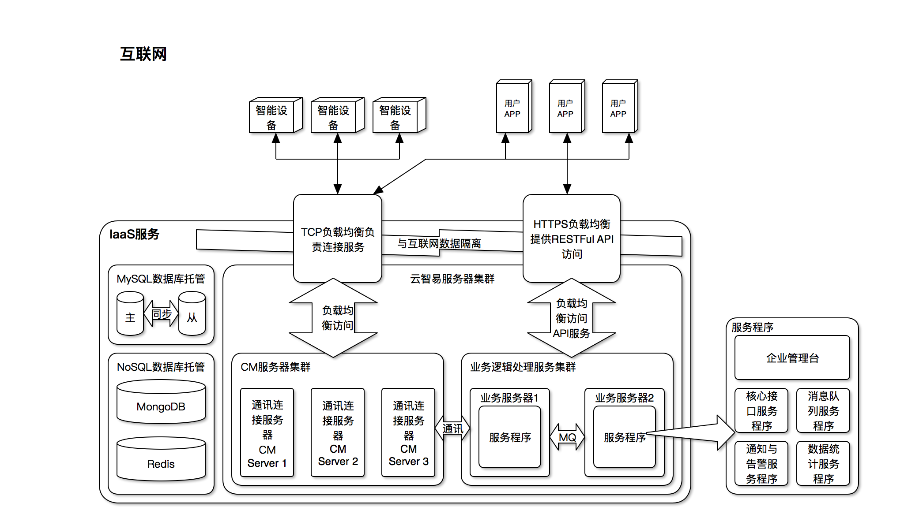
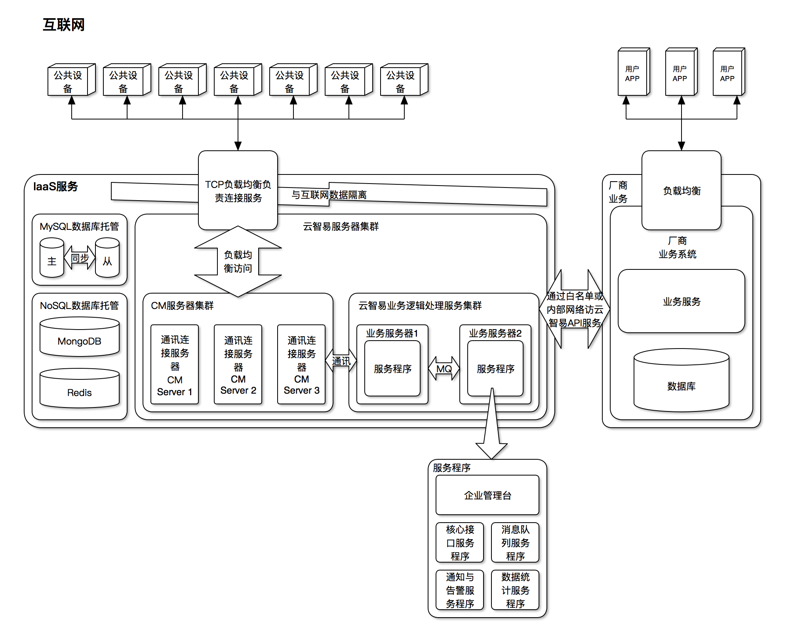

# 云智易私有云部署设计（IaaS方式）

* 文档为部署在IaaS平台中的私有云提供方案和建议
* 文档将从安全，高可用和容灾等角度进行分析和建议

## 总概

* 云智易支持（推荐）厂商将私有云平台部署到IaaS平台上
* 云智支持国内外多个IaaS提供商的私有云部署，如阿里云、腾讯云、百度云、AWS和微软Azure。

## 部署设计

* 在智能硬件控制领域，比较常见的有**[普通智能设备](#common_device)**的控制和**[公共智能设备](#public_device)**的控制。由于其领域不同，在实施部署方案上会有一些差异。

### <a name="common_device">普通智能设备</a>

#### 部署图

#### 说明

* 普通智能硬件控制多为手机APP直接控制硬件，以达到方便快捷的控制体验。在这种方式下，设备和手机APP用户存在所属关系，设备是属于用户的。然后在控制时会需要支持同一个局域网不经过云端的直接控制。
* 云端情况下设备和手机APP都会直接连接上云智易的连接服务器，通过连接服务器直接转发和交换控制指令。云智易的连接服务器通过设备和手机APP的绑定关系，来决定控制指令是否传递给硬件，以及硬件的状态是否发送给手机APP。

#### 部署建议

1. 使用IaaS服务商的RDS数据库托管。推荐使用主从服务。
2. 使用IaaS服务商的MoSQL数据库托管服务，云智易支持MongoDB和Redis服务。其中腾讯云和阿里云都对这两种NoSQL提供了托管服务。
3. 至少使用两台计算资源作为CM连接服务。
4. 至少使用两台计算资源作为云智易业务服务。
	* 若预算有限，云智易支持将CM服务器和业务服务器合并。但推荐还是需要两台作为高可用。
5. 不将云智易的API服务器和CM服务器的公网IP直接对外，使用负载均衡作为服务接入入口。
6. 使用RDS定时备份和计算资源定时快照

### <a name="public_device">公共智能设备</a>

#### 部署图

#### 说明

* 公共智能设备与普通家用智能设备最大的区别在于设备和用户的从属关系上，公共设备是属于服务提供商，而不属于用户。用户APP虽然可以控制设备，但是不拥有这个设备，不能直接控制这个设备。手机APP必须通过服务提供商进行用户认证，数据分析以及业务处理后，由服务提供商通过云对云的方式，由云智易提供的RESTFul API接口控制智能硬件。
* 并且大多数公有智能设备都提供租用服务和收费服务，对安全的要求更高。所以云智易推荐采用网络隔离的方案，不将API服务暴露给Internet，全部采用内部通讯或者是网络白名单的方式，将设备的控制能力交给服务提供商。

#### 部署建议

1. 使用IaaS服务商的RDS数据库托管。推荐使用主从服务。
2. 使用IaaS服务商的NoSQL数据库托管服务，云智易支持MongoDB和Redis服务。其中腾讯云和阿里云都对这两种NoSQL提供了托管服务。
3. 至少使用两台计算资源作为CM连接服务。
4. 至少使用两台计算资源作为云智易业务服务。
	* 若预算有限，云智易支持将CM服务器和业务服务器合并。但推荐还是需要两台作为高可用。
5. 不将云智易的CM服务器的公网IP直接对外，使用负载均衡作为服务接入入口。
6. 不开放云智易API服务的公网访问权限，云智易服务API只对接厂商的服务器。
7. 使用RDS定时备份和计算资源定时快照

## 安全和容灾恢复建议

* 云智易支持SSL加密的数据传输，建议厂商能够采用SSL证书和HTTPS的安全通讯，对RESTFul API通讯数据进行保护。
* 云智易不建议将数据库访问权限暴露在公网中。请尽量使用内网通讯的方式进行数据库访问。
* 云智不推荐厂商在计算资源中直接部署数据库服务，请使用IaaS提供的数据库托管服务，可以保证数据的稳定可靠。并且非常容易进行弹性扩展而不会中断服务。以及在容灾、备份、恢复、监控、迁移等方面都有配套的服务，会大大降低运维的成本。
* 大多IaaS服务商都提供数据库主从服务，请使用数据库主从服务保证数据服务不会中断。
* 云智易不建议直接把RESTFul API访问接口和设备TCP连接服务直接暴露在公网，请采用IaaS提供商提供的负载均衡器作为前端连接入口。负载均衡服务既可以过滤常见的DDOS攻击，又可以均衡访问负载，提供最佳用户体验。
* 云智易的连接服务在设计就以分布式作为核心诉求。在部署时采用多套服务同时运行的方案，一方面既提供了高可用的服务提供，一台服务出现问题，配合前端的负载均衡，可以让另外的连接服务单元马上接管连接，不会造成服务的中断。同时横向扩展也非常容易。
* 云智易的内部服务单元采用高可靠的MQ作为通讯方式，一样支持多点分布和横向扩展。为了保证高可用，请采用多点方式部署云智的内部子服务。

